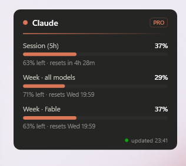
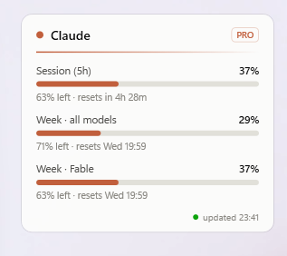

# Usage Limit Tracker

A Windows-native desktop widget that lives on your desktop like a sticky note — every app
window sits **on top** of it — showing your live Claude usage limits: how much you've used,
how much is left, and exactly when each limit resets.

> **Lightweight** — a 191 KB exe, ~63 MB private RAM, ~0% idle CPU, zero third-party
> packages. Total CPU used since launch: under 1 second.

## Screenshots

| Dark theme | Light theme |
|---|---|
|  |  |

## What it shows

One meter per limit on your Claude plan, straight from Anthropic's usage endpoint —
the same numbers claude.ai displays:

- **Session (5h)** — the rolling 5-hour window
- **Week · all models** — the weekly cap
- **Week · \<model\>** — per-model weekly caps (e.g. Fable), when your plan has them

Each row shows percent used, percent left, and a live reset countdown
("resets in 4h 40m", or "resets Wed 20:00" when further out). Meters are coral normally,
turn **amber at 80%** and **red at 95%**, and a toast notification fires once per reset
period at each of those thresholds.

## How it works

- Reads Claude Code's local OAuth token from `%USERPROFILE%\.claude\.credentials.json`
  (**read-only** — Claude Code owns the token and refreshes it itself).
- Polls `https://api.anthropic.com/api/oauth/usage` every 5 minutes (plus once on
  wake-from-sleep). No scraping, no manual logging.
- If anything goes wrong it degrades gracefully: keeps the last data and shows
  `stale` (sign-in expired), `offline` (no network), or a hint if no Claude Code
  sign-in exists on the PC.

## The sticky-note trick

The window is forced to the bottom of the z-order on every z-order change
(`WM_WINDOWPOSCHANGING` → `HWND_BOTTOM`), so it can never cover another app. It has no
taskbar entry, is hidden from Alt+Tab, never steals focus, and quietly restores itself
if Show Desktop minimizes it.

## Usage

- **Drag** it anywhere with the left mouse button (position is remembered).
- **Right-click** for the menu:
  - Refresh now
  - Lock position
  - Notifications
  - Light theme
  - Start with Windows
  - Exit

Settings are stored in `%APPDATA%\UsageWidget\settings.json`.

## Requirements

- Windows 10/11.
- [.NET 8 Desktop Runtime](https://dotnet.microsoft.com/download/dotnet/8.0) to run
  (Windows offers the download automatically if it's missing); the .NET 8 SDK to build.
- **Claude Code installed and signed in** with a claude.ai subscription (Pro/Max) on the
  same PC — the widget reads Claude Code's local sign-in to fetch your limits. Without it,
  the widget starts fine but shows "Claude Code sign-in not found". API-key, Bedrock, or
  Vertex sign-ins have no subscription limits and won't work.

## Building

Requires the .NET 8 SDK.

```powershell
# Run from source
dotnet run --project src\UsageWidget

# Publish a single-file exe to .\publish\
dotnet publish src\UsageWidget\UsageWidget.csproj -c Release -r win-x64 --self-contained false -p:PublishSingleFile=true -o publish
```

Then run `publish\UsageWidget.exe`. Right-click → *Start with Windows* to make it permanent.

## Notes

- The usage endpoint is undocumented, so a future change on Anthropic's side would show
  up as a persistent `offline`/`stale` state rather than a crash — and would be a small fix here.
- ChatGPT / Gemini don't offer usage APIs for consumer plans; the provider interface in
  `src/UsageWidget/Services` is ready for manual-tracker providers if they're ever wanted.
